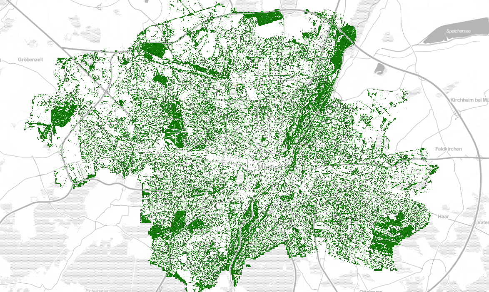

# 🌲 Urban Tree 🌲

## detect urban trees with the help of aerial images

An interactive [map](https://easz.github.io/urban-tree/index-s.html) to find missing trees.

A short introduction and background story: [here](https://tsungi.medium.com/urban-trees-in-munich-city-b0e7db7c2c18).

## Goals

 - [x] determine urban tree coverage in Munich City 🍺 from different years and visualize result in a map to assist finding missing trees
 - [x] identify missing trees (or ideally new planted trees) automatically
 - [ ] enhance tree detection performance with better images and transfer learning
 - [ ] gather tree (crown) information and serve as input for OpenStreetMap or further tree registration purpose
 - [ ] try with different locations (e.g. cities)

### Challenge

 - Freely available aerial images may not have good image resolution and would not have infrared or depth information.
 - Trees can be hardly identified if aerial images are not ideally captured in summer season.
 - Manual labeling and annotating trees in aerial images is time consuming and its quality can be far from perfect due to low resolution images.
 - Young urban trees can be very small to detect.

### Methods and further improvement

 - RGB-only color aerial image photos (available open data) from Munich as input
   - [ ] train with manually corrected inference results
   - [ ] train with CIR or Lidar dataset
   - [ ] train with any public available dataset (e.g. [zenodo](https://zenodo.org/), [kaggle](https://www.kaggle.com/))
 - machine learning
   - supervised learning with a small amount of imprecise (handcrafted) training data with annotations
   - "traditional" computer vision methods on pixel feature vectors (e.g. color, texture and etc.) with Adaboost classifier
   - "deep learning" neural network (e.g. RetinaNet)
 - visualization (e.g. tree canopy as map overlay)

## Step-by-Step workflow to detect urban trees from aerial imagery

ℹ️ This repository contains Python notebooks with which you can reproduce the result by your own.
The source images, training data with annotations are not available yet in this repository due to their file sizes and constantly change under experiment.
You may find any trained model in the [releases](https://github.com/easz/urban-tree-munich/releases) page while other assets have to be downloaded or generated additionally.

### Required tool

 - [wms-tile-get](https://github.com/easz/wms-tile-get/) for downloading map tiles from map server
 - [detectree](https://github.com/martibosch/detectree), [DeepForest](https://github.com/weecology/DeepForest) for machine learning specialized for tree classification and segmentation
 - [labelme](https://github.com/wkentaro/labelme) for image annotation or labeling
 - [conda](https://docs.conda.io/en/latest/miniconda.html) to manage python environment and install packages
 - [GeoServer](http://geoserver.org/) for manage, render and serve maps
 - [QGIS](https://www.qgis.org/) for display and inspect maps

### Step 0: Retrieve aerial images from map servers

### OpenData Map source

#### Munich City

 - [Luftbilder der Landeshauptstadt München 60 cm Bodenauflösung](https://ogc.muenchen.de/wms/opendata_luftbild?service=WMS&version=2.0.0&request=GetCapabilities): images with 0.6m resolution taken in the summer 2017
 - [Digitales Orthophoto 80cm (BVV)](https://geodatenonline.bayern.de/geodatenonline/seiten/wms_dop80cm): images with 0.8m resolution taken on 26-April-2020
 - [Luftbild München 2019 RGB 20cm](https://geoportal.muenchen.de/geoserver/gsm/wms?service=WMS&version=2.0.0&request=GetCapabilities): images with 0.2m resolution taken probably on a winter day in 2019

#### Retrieval of aeriel images

Use `wms-tile-get` to download map tiles from WMS and store in [Slippy Map structure](https://wiki.openstreetmap.org/wiki/Slippy_map_tilenames) (i.e. XYZ format). *Alternatively arbitrary extents of map images can also be directly requested from WMS server. However, XYZ format is preferable for offline data storage.*

~~~
 $ wms-tile-get -s contrib/munich/wms.munich_2017.json \
                -g contrib/munich/munich.boundary.geojson \
                -z 18 \
                -o aerial_images/opendata_luftbild_dop60
~~~

~~~
 $ wms-tile-get -s contrib/munich/wms.munich_2020.json \
               -g contrib/munich/munich.boundary.geojson \
               -z 18 \
               -o aerial_images/by_dop80c
~~~

Alternatively you can download cached map tiles from [opendata_luftbild_dop60](https://github.com/easz/opendata_luftbild_dop60_Y2017) and [by_dop80c](https://github.com/easz/by_dop80c_Y2020).

~~~
 $ git clone https://github.com/easz/opendata_luftbild_dop60_Y2017 aerial_images/opendata_luftbild_dop60
~~~

~~~
 $ git clone https://github.com/easz/by_dop80c_Y2020 aerial_images/by_dop80c
~~~

#### Step 1: Setup and Configuration

 - Most of following steps are done in Python notebooks.
 - The global configurable parameters stored in `settings` folder are shared by all notebooks.
 - working folders are organized with [structure](Structure.md)

#### Step 2: Re-sample tiles

See [wf-resample-map-tiles](wf-resample-map-tiles.ipynb) notebook

 - generate tiles with arbitrary sizes with overlapping.
 - generate tiles are in geo-referenced TIFF format.
 - A additional meta data is generated containing `nodata` ratio of each resampled image.

#### Step 3: Split data set into train/test sets

See [wf-feature-split-dataset](wf-feature-split-dataset.ipynb) notebook

 - some representative images are selected as training data for supervised machine learning.
 - The selected training data will be copied to the specified training folder.
 - *Alternatively, you can just randomly select training set.*

### Step 4: Labeling training data

 - Manually labeling with `labelme`
  - for simplicity trees are labeled/masked with circles.

#### For `detectree` method:

  - the training images have to be at first converted to raster images with [labelme_json_to_dataset](https://github.com/wkentaro/labelme/blob/main/labelme/cli/json_to_dataset.py) command

~~~
 $ for f in *.json; do labelme_json_to_dataset $f; done
~~~

  - then, generate response dataset with [wf-segmentation-generate-response](wf-segmentation-generate-response.ipynb)

#### For `deepforest` method:

 - Generate response dataset with [wf-detection-generate-response](wf-detection-generate-response.ipynb)

### Step 5: Training

See [wf-segmentation-train-model](wf-segmentation-train-model.ipynb) and [wf-detection-train-model](wf-detection-train-model.ipynb) notebooks

 - The trained result (i.e. classifier model) will be stored in the specified output folder.

### Step 6: Model Inference on images

See [wf-segmentation-inference](wf-segmentation-inference.ipynb) and [wf-detection-inference](wf-detection-inference.ipynb) notebooks

 - detect trees in images
 - the result will be stored in the specified folder

### Step 7: Review

- Use `GeoServer` to create data `Store` of `ImageMosaic` type containing the folder of prediction result and serve them (e.g. via WMS or WMTS service) as web map tiles.
- Use `QGIS` (e.g. open `overview.qgs`) to review map tiles by adding corresponding layers.

## Credit

### Based on amazing work

- [Bosch M. 2020. “DetecTree: Tree detection from aerial imagery in Python”. Journal of Open Source Software, 5(50), 2172.](https://doi.org/10.21105/joss.02172)
- [Yang, L., Wu, X., Praun, E., & Ma, X. (2009). Tree detection from aerial imagery. In Proceedings of the 17th ACM SIGSPATIAL International Conference on Advances in Geographic Information Systems (pp. 131-137). ACM.](https://static.googleusercontent.com/media/research.google.com/en//pubs/archive/35659.pdf)
- [Weinstein, B.G.; Marconi, S.; Bohlman, S.; Zare, A.; White, E. Individual Tree-Crown Detection in RGB Imagery Using Semi-Supervised Deep Learning Neural Networks. Remote Sens. 2019, 11, 1309](https://www.mdpi.com/2072-4292/11/11/1309)

### Additional map material
 - [stamen map](http://maps.stamen.com/)
 - [OpenStreetMap](https://www.openstreetmap.org/)
